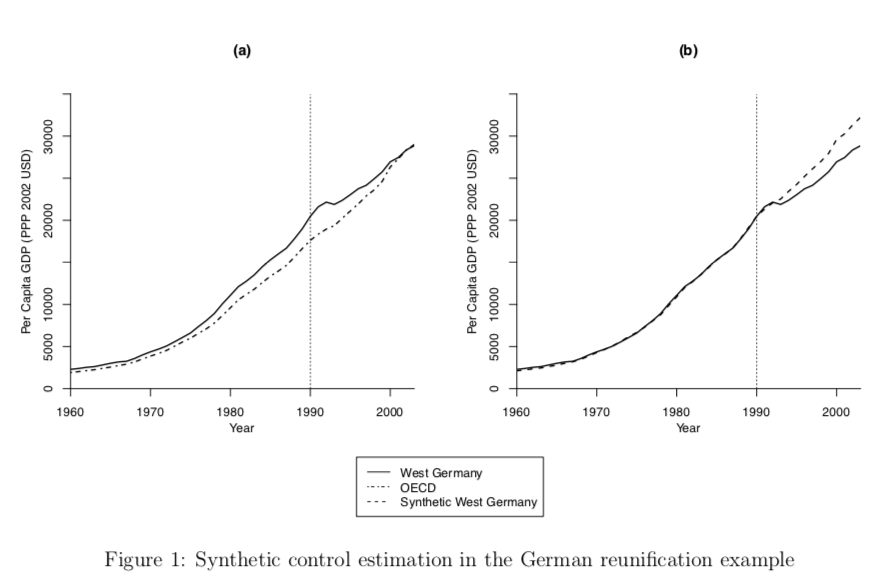

```{r setup, include=FALSE}
options(htmltools.dir.version = FALSE)
knitr::opts_chunk$set(warning = FALSE, message = FALSE, 
  comment = NA, dpi = 300, echo = FALSE, cache = F,
  fig.align = "center", out.width = "100%", fig.asp = 0.618)
```

```{r xaringan-themer, include=FALSE}
library(xaringanthemer)
duo(
  # primary_color = "#FDFFF1",
  primary_color = "#ECECEC",
  secondary_color = "#2a488e",
  text_color = "#000000",
  title_slide_text_color = "#000000", 
  # secondary_color = "#4671d6",
  # text_color = "#2C3E50",
  header_font_google = google_font("Josefin Sans"),
  text_font_google   = google_font("Montserrat", "300", "300i"),
  code_font_google   = google_font("Droid Mono"),
  text_font_size = "25px", 
  text_slide_number_font_size = "0.0em"
)

```

class: middle, center

> ...arguably the most important innovation in the policy evaluation literature in the last 15 years (Athey and Imbens 2017)

---

## When to use

- Large scale, infrequent interventions on aggregate units 

- Long time-series 

- Examples: effect of reunification on West Germany's economy; effect of Mariel boatlift on native employment

---

## What it does

- Say we want to know the effect of reunification on the West German economy

--

- Maybe we can compare it to other countries - take the average per capita GDP of all other countries

--

- How do we choose which countries? Should all countries be equally important? Intuitively, Austria is probably a better comparison than Thailand

--

- Synthetic control helps us to choose the weights for each country - its goal is to create a synthetic West Germany that "looks similar" to *actual* West Germany before reunification

---

### Left: simple average; Right: Synthetic control weights

```{r}

```


---

## Alternatives to synthetic control?

- Interrupted time series - great for large effects in the short-term, not so much for long-term outcomes

- Comparative case studies - selection of control units not formalized

---

class: inverse, middle, center

## How it works

---

### Notation

Say we have a set of countries $j = 1, 2, \dots, J + 1$ 

- unit $1$ was "treated", units $2, ...., J$ are in the "donor pool"

$T_0$ is the year of the intervention (e.g. German reunification)

Outcomes are $Y_{jt}$

Covariates are $X_{1}, \dots, X_{J+1}$

Each $X_j$ is a $k$ by $1$ vector and can include pre-treatment outcomes

Donor pool covariates are $X_0 = [X_{2}, \dots, X_{J+1}]$ 

---

For $t > T_0$, we want to know 

$$\tau_{1t} = Y_{1t}(1) - Y_{1t}(0)$$

We observe $Y_{1t}(1)$ - what happened to W Germany, but not $Y_{1t}(0)$ - what *would have* happened to W Germany

--

Estimate $Y_{1t}(0)$ by taking a weighted average of all the other countries 


$\hat{Y_{1t}(0)} = w_2 Y_{2t}(0) +  w_3 Y_{3t}(0) + \dots + w_{J+1} Y_{J+1, t}(0)$

The weights $w_j$ sum to one and are non-negative. 

---

## How should we choose these weights?

- Choose $w_2, \dots, w_{J+1}$ so that the synthetic control and the treated unit have similar $X$'s

Mathematically, choose $W* = (w_2, \dots, w_{J+1})$ that minimizes 

$$\lVert X_1 - X_0W  \rVert = \big(\sum_{h = 1}^{k}v_h(X_{h1} - w_2X_{h2} - \dots - w_{J+1}X_{h,J+1})^2 \big)^{\frac{1}{2}}$$

---

$$\lVert X_1 - X_0W  \rVert = \big(\sum_{h = 1}^{k}v_h(X_{h1} - w_2X_{h2} - \dots - w_{J+1}X_{h,J+1})^2 \big)^{\frac{1}{2}}$$

--

- Notice the appearance of a new term, $v_h$

- $v_h$ reflects the importance of each covariate as a predictor of the counterfactual $Y$'s

- We have to choose $v_h$. How?

--

- Option 1: divide the pre-intervention period ($t < T_0$) into a *training* period and a *validation* period, choose $V$ that best predicts outcomes in the validation period

--

- Option 2: using the *entire* pre-intervention period, choose $V$ that best fits pre-intervention outcomes 

--

- Option 1 makes a lot of sense but seems to have [some issues](http://www.oekonometrie.uni-saarland.de/papers/Cross-Validation.pdf) because it doesn't guarantee a unique $V$

---

## Inference using permutation test

1. Take a control unit
1. Apply the synthetic control method to it
1. Estimate the "effects" on the control unit
1. Repeat

Compare the size of the estimated treatment effects to the placebo treatment effects

---


---

```{r gen_pdf, include = FALSE, cache = FALSE, eval = FALSE}
pagedown::chrome_print("synth_abadie2019.html", output = "synth_abadie2019.pdf")
```

